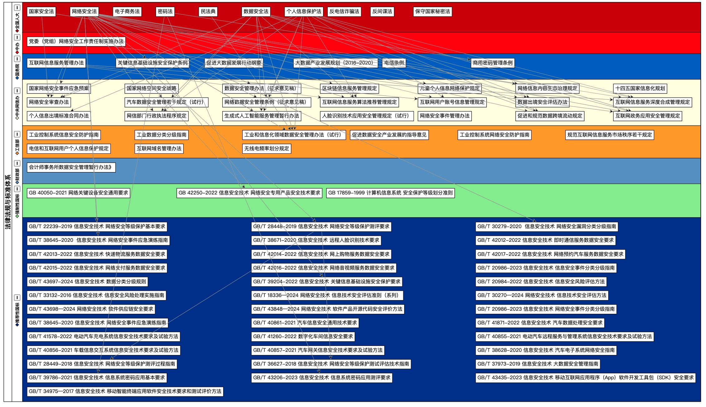

# 安全合规检查表

这是一个检查清单项目，旨在简化网络安全、数据安全中的安全合规落地过程。

合规是技术的一种需求 、一种演进、一种力量

## 背景

当前中国国内的网络安全、数据安全、信息安全相关法规的大致情况可以参考下图（更新中……）

## 检查表

- [安全合规检查表](#安全合规检查表)
  - [背景](#背景)
  - [检查表](#检查表)
    - [个人信息保护](#个人信息保护)
    - [汽车数据处理](#汽车数据处理)
    - [数据出境评估](#数据出境评估)

### 个人信息保护

以下内容参考了《个人信息保护法》、《GDPR》等涉及个人信息保护的法规。

- [ ] 拥有可公开访问的隐私政策，该政策描述了与个人数据相关的所有流程。其中应包含内容有：信息处理者名称、联系方式、数据处理的目的、方式、信息种类、保存期限、个人行使个人信息保护法规的方式和程序等等。
- [ ] 隐私政策中明确阐释了本组织需要处理个人信息的合法依据（基于个人的同意、基于合法的合同、基于法定义务等）。
- [ ] 如果数据处理是基于用户同意的，则此类同意必须是用户自愿的、具体的、知情的和可撤销的。应有过程记录等可证明这一点，并提供了用户可访问的修改“用户同意”的工具。
- [ ] 在更新隐私政策、改变个人信息处理目的、处理方式时，应通知了所有的现有客户，并重新获得用户同意。
- [ ] 用户在撤回同意时，应与最初赋予同意时一样容易。有专门的应用或系统支持这一点。
- [ ] 处理涉及儿童的个人数据时，验证了他们的年龄并征求了其法定监护人的同意，且有明确的过程记录可证明。
- [ ] 隐私政策应该以显著方式、清晰易懂的方式编写。
- [ ] 定期审查政策的变化、有效性、数据处理的变化以及您的数据流向的其他国家/地区的事态变化，并详细记录审查过程和结论。
- [ ] 提供了可用的应用或支持系统，使客户可以轻松请求访问他们的个人信息。
- [ ] 提供了可用的应用或支持系统，使客户可以轻松更新自己的个人信息以保持准确。
- [ ] 已经通过管理控制和技术手段确保不再使用的个人信息会被自动删除。
- [ ] 提供了可用的应用或支持系统，使客户可以轻松请求删除他们的个人数据。
- [ ] 提供了可用的应用或支持系统，使客户可以轻松要求您停止处理他们的数据。
- [ ] 提供了可用的应用或支持系统，使客户可以轻松请求将他们的数据传送给自己或转移给第三方。
- [ ] 提供了可用的应用或支持系统，使客户很容易反对可能影响他们的分析或自动决策。
- [ ] 已任命一名数据安全管理者（或称为数据保护官 DPO）。
- [ ] 管理层、决策者对《个人信息保护法》（以及GDPR等）有清晰的理解和认识。
- [ ] 确保所使用的各类技术及软硬件实现的安全更新是最新的。
- [ ] 对员工开展了数据保护培训，并详细记录了过程和参加人员。
- [ ] 拥有并持续更新一个子级数据处理者列表（含子公司、供应链的直接下游），并且隐私政策中明确了与该子级处理者的关系和数据处理过程。
- [ ] 如果在境外运营，本组织已在境内（例如GDPR中的欧盟、中国个人信息保护法中的中国……）指定了一名数据安全代表负责相关事务。
- [ ] 在发生涉及个人信息的数据泄露事件时，及时（GDPR要求72h内、中国对重大级以上事件要求1h内）向地方当局和相关人员（数据主体）报告。
- [ ] 共享数据的任何数据处理者都签订了数据安全相关合同，并明确了数据处理的目的、期限、处理方式、个人信息类型、保护措施、各方权利和义务。同时，要对进行合同执行情况的检查并保留检查的过程证据和结果。
- [ ] 拥有并持续更新个人信息清单。清单列出了组织持有的各种个人信息的类型、信息来源、数据共享者、数据处理内容及过程，以及保存这些信息的时间期限。
- [ ] 拥有且持续更新记录处理个人信息的地点位置、以及数据在这些位置之间交互方式的清单。
- [ ] 组织的管理层和业务相关人员了解何时必须执行业务所在地当地授权（例如某些欧盟国家在GDPR外的本地法规） 来对敏感数据进行高风险处理。
- [ ] 数据的传输、转移必须在合法合同保证下进行，并告知用户数据接收方的名称、联系方式、处理目的、处理方式、个人信息类型，并获得用户同意。欧盟GDPR要求仅将数据传输到境外提供适当保护级别的国家/地区。
- [ ] 定期审查政策的变化、有效性、数据处理的变化以及数据流向的其他国家/地区的事态变化，并详细记录审查过程（用于证明和溯源）。
- [ ] 自动化决策方式进行的信息推送、商业营销，应向个人提供便捷的拒绝方式。
- [ ] 对于生物识别、宗教信仰、特定身份、医疗健康、金融账户、行踪轨迹等敏感个人信息，以及不满十四周岁未成年的个人信息，应使用专门隐私保护策略和安全防护技术。处理这类信息应取得个人单独同意，最好是单独的书面同意。
- [ ] 向中国境外提供个人信息的，需要经过国家网信部门的安全评估、专业机构认证、签订标准合同、遵循专项法律法规。
- [ ] 关键信息基础设施运营者、处理个人信息数量达到规定数量（目前常见要求是10万条）的个人信息处理者，应将数据存储在境内。

### 汽车数据处理

- [ ] 对汽车数据进行了分类分级。在分类上，可按设计、生产、销售、使用、运维等过程分类；在级别上，至少分为敏感个人信息、一般个人信息、重要数据、非重要数据等。
- [ ] 建立隐私保护政策等数据安全管理文件，阐明本组织需要处理汽车数据的合法依据（基于个人的同意、基于合法的合同、基于法定义务等）。
- [ ] 基于互联网的数据处理系统，按照网络安全等级保护制度（并结合当地网信、公安要求）进行规划、建设、备案、测评和运维。
- [ ] 未脱敏、未去标识的信息，特别是敏感个人信息和重要数据，尽量不收集、尽量车内处理、尽量不外传、尽量适度精度、尽量脱敏。
- [ ] 隐私保护策略应以显著方式、清晰易懂的方式编写并通过用户手册、车机显示屏、语音、手机App等多种形式告知用户。
- [ ] 拥有可公开访问的隐私政策，该政策描述了与个人数据相关的所有流程。其中应包含内容有：信息处理者名称、联系方式、收集及停止收集的方式、数据处理的目的、方式、信息种类、保存地点、保存期限、个人行使个人信息保护法规的方式和程序等等。
- [ ] 如果数据处理是基于用户同意的，则此类同意必须是用户自愿的、具体的、知情的和可撤销的。应有过程记录等可证明这一点，并提供了用户可访问的修改“用户同意”的工具。
- [ ] 因保证行车安全等需要，无法征得个人同意采集到的车外个人信息，应进行匿名化处理、去标识处理。
- [ ] 敏感个人信息，应明确数据处理的合法依据且应取得个人单独同意，并提供采集提示、终止收集便利，个人要求删除的应当在10个工作日内删除。
- [ ] 重要数据（目前含6类）的处理，应向省级网信等（还包括公安、工信等）部门提交风险评估报告，说明重要数据的种类、数量、范围、保存地点与期限、使用方式、处理活动、向第三方提供情况、数据安全风险及其应对措施等。
- [ ] 重要数据应在中国境内存储，尽量不外传、不外储。特别地，向境外提供需要通过国家网信办等部门的审批，具体参考最新的《促进和规范数据跨境流动规定》。
- [ ] 重要数据处理应每年12月25日前向省级网信部门报告数据安全管理情况，包括负责任人姓名、联系方式、数据种类、规模、目的、必要性、安防措施、保存地点和期限、向境外提供情况、安全事件与处置情况、数据相关用户投诉和处置情况、其他要求的情况。
- [ ] 设立了汽车数据处理活动投诉渠道，如网站或支持系统。

### 数据出境评估

- [ ] 在向境外提供国内运营中收集和产生的数据前，对准备出境的数据进行了清点，拥有并维护数据清单（类型、敏感度、数量、国内处理者、境外接受者、范围、目的、处理过程、安全防护、维权方式、联系人……），开展了数据出境安全风险自评估。
- [ ] 在自评估全面讨论了（1）合法性，即数据出境及境外接收者数据处理的目的、范围、方式的合法性；（2）可能的安全风险，即出境数据的规模、范围、种类、敏感程度，以及对国家、公众、组织、个人的风险；（3）境外接收方的责任义务、应对风险的防护能力、事后维权方式；（4）其他安全事项。
- [ ] 提供数据前，通过所在地省级网信部门向国家网信申报并通过了数据出境安全风险评估。特别是向境外提供重要数据的、运营关键信息基础设施的、处理100万人以上个人信息的、累计向境外提供10万人个人信息的、累计1万人敏感个人信息的等等。
- [ ] 为获得国家网信部门审批，备有数据出境安全评估申报书、风险自评估报告、与境外接收方签订的法律文件、其他要求文件、企业经营证照等。
- [ ] 为获得国家网信部门审批，已按照《出境标准合同备案指南（第二版）》、《个人信息出境标准合同备案指南（第二版）》进行申报，申报系统网址 https://sjcj.cac.gov.cn。
- [ ] 与境外接收方订立的法律文件中明确约定了任何可能场景的数据安全保护责任义务，包括：（1）数据出境的目的、方式和数据范围，境外接收方处理数据的用途、方式等；（2）数据在境外的保存地点、期限，以及到期或合同终止时出境数据的处理措施；（3）对出境数据再转移的限制要求；（4）境外接收方发生控制权、经营范围等各种变化时、所在国家和地区数据安全法规变动时、不可抗力发生时的数据安全保护措施；（5）违约时的补救措施、违约责任、争议解决方式；（6）数据被泄漏、破坏、丢书等时的应急要求和维权方式。
- [ ] 申报过程一般会超过2个月。对于已按要求提交的申请，国家网信办7个工作日内确认是否受理；受理后45个工作日内完成评估，情况复杂的会延长。
- [ ] 对国家网信办的评估结果有异议的，要在收到评估结果15个工作日内提交复评，并补充、更在所有材料。
- [ ] 通过数据出境安全评估的结果有效期为2年，出现任何可能影响到数据安全的新情况都需要重新申报；有效期届满，仍需向境外提供数据的，在届满前60日重新申报。
